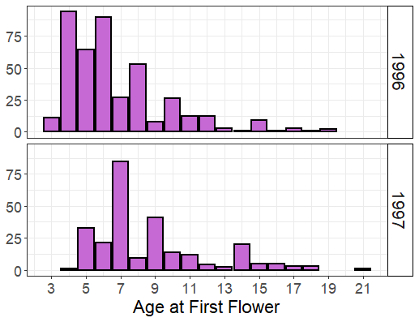
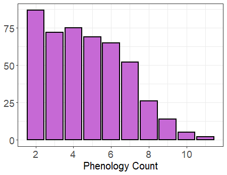
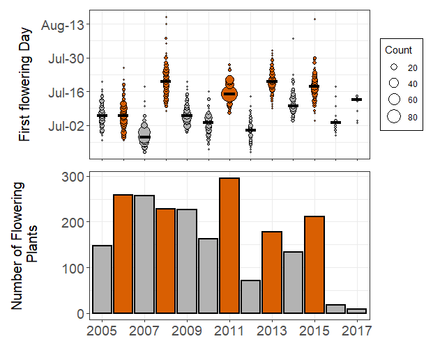
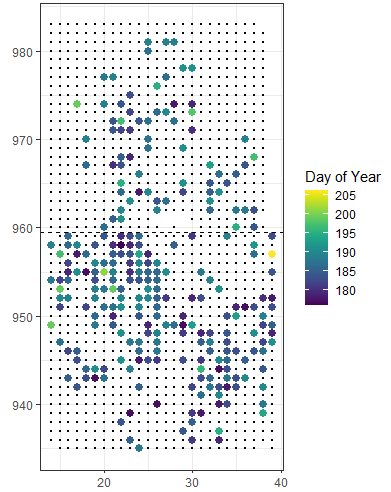

```{r setup, include=FALSE}
options(htmltools.dir.version = FALSE)
library(dplyr)
library(ggplot2)
```

```{r xaringan-themer, include=FALSE, warning=FALSE}
library(xaringanthemer)
style_duo_accent(
  primary_color = "#667056",
  secondary_color = "#5F1343",
  inverse_header_color = "#FFFFFF",
  header_font_google = google_font("Noto Sans JP"),
  text_font_google = google_font("Open Sans"),
  code_font_google = google_font("Fira Code"),
   extra_css = list(
    ".large" = list("font-size" = "130%"),
    ".pull-left-narrow" = list("float" = "left",
                               "width" = "35%")
  ))

```


.large[I'm not an expert]

--

.large[Would love your feedback]


--


---

.large[_Echinacea angustifolia_]


.pull-left[

- Perennial prairie plant

- Doesn't flower before 3 years old. Doesn't flower every year. 

- Composite flower; flowering proceeds from bottom to top of head.

- Self-incompatible

- No specialist pollinators

- Might have more than one flowering head in a given year. 

]

.pull-right[


]

---
### Previous research on flowering phenology

.large[Earlier flowering plants have a higher seed set than later flowering plants] (Ison and Wagenius, 2014. _JoE_)

--

Higher seed set via pollinator mediated mechanisms (Ison et al. 2018 _Oikos_).

--

i. Pollinators visit earlier flower plants more often than later flowering plants.

--

ii. Pollinator community less diverse later in the season (dominated by single spp of _Augochlorella_)

--

iii. Late season pollinators carried less conspecific pollen relative to early season pollinators visiting _Echinacea_ plants.  

--

### Are the same plants flowering early each year? 

---

### Common Garden Experiment
.pull-left-narrow[
**1996**: 646 plants from 8 remnants

**1997**: 591 plants from 15 remnants 


Census data (plants alive vs. dead, flowering vs. non-flowering) since 1996/1997


Phenology data (start date, end date for each flowering head) since 2005


Plot is burned every 2-3 years

]


```{r, echo = FALSE, message = FALSE, fig.align='right', warning = FALSE}
rowpos <- readr::read_csv("dat/cg1CoreData.csv") %>%
  select(cgPlaId:yrPlanted) %>%
  filter(yrPlanted == 1996 | yrPlanted == 1997) %>%
  mutate(yrPlanted = as.factor(yrPlanted))

rowpos %>%
  ggplot(aes(row, pos))+
  geom_point(aes(color = yrPlanted), size = 3)+
  geom_hline(yintercept = 959.5, lty = 2, size = 1)+
  coord_fixed()+
  guides(color = guide_legend(reverse = TRUE))+
  labs(x = NULL, y = NULL, color = "Planting Year")+
  scale_color_manual(values = c("#667056", "#C669D5"))+
  theme_bw()+
  theme(legend.title = element_text(size = 18),
        axis.text = element_text(size = 16),
        legend.text = element_text(size = 15))
  
```


---

### Census data (1996 - 2018)

```{r, echo = FALSE, out.width=475}



```
---

### Phenology data (2005 - 2017)

```{r, echo = FALSE, out.width=475}



```

#### Removed plants that flowered 0 or 1 time during study period. 

---
### Phenology data (2005 - 2017)

```{r, echo = FALSE, out.width=650}



```
---
### Phenology data

.large[
- First flowering date (FFD) 
      - `startNum`

- Flowering duration

- Head Count]

---

### Repeatability 

_Intra-class Correlation Coefficient (ICC)_

Fraction of total variation that can be attributed to varation among groups. 

$$R = \frac{V_g}{V_g + V_r}$$
V<sub>g</sub> = among group variance

V<sub>r</sub> = within group (residual) variance

--

**Repeatability can be low due to high within group variation *or* low between group variation.**

---

### r package {rptR}

- Uses `glmer` notation
- Random effects = grouping variable 
- Fixed effects = "adjustments" ("remove variance explained by fixed effects")
    - "consistency repeatabilities"

---

### Adjustments

.pull-left-narrow[
- Year
- Cohort
- Location (X & Y in common garden plot)]

```{r, echo = FALSE, fig.align='right', out.width=425}



```

---
```{r, eval = FALSE}
r1 <- rpt(startNum ~ year + yrPlanted  + row + pos + (1|cgPlaId), 
            grname = "cgPlaId",
            data = phen_19967, datatype = "Gaussian",
            nboot = 1000, npermut = 1000, parallel = TRUE)`
```
---
`summary(r1)`
```{r, eval = FALSE}
Repeatability estimation using the lmm method

Call = rpt(formula = startNum ~ year + yrPlanted + row + pos + (1 | cgPlaId), grname = "cgPlaId", data = phen_19967, datatype = "Gaussian", nboot = 1000, npermut = 1000, parallel = TRUE)

Data: 2194 observations

cgPlaId (467 groups)

Repeatability estimation overview: 
      R     SE   2.5%  97.5% P_permut  LRT_P
  0.222 0.0233  0.181  0.272    0.001      0  #<<

Bootstrapping and Permutation test: 
            N    Mean  Median   2.5%  97.5%
boot     1000 0.22489 0.22410  0.181 0.2718
permut   1000 0.00695 0.00194  0.000 0.0304

Likelihood ratio test: 
logLik full model = -6232.085
logLik red. model = -6306.833
D  = 149, df = 1, P = 1.12e-34
```

---
```{r, eval = FALSE}
Linear mixed model fit by REML ['lmerMod']
Formula: startNum ~ year + yrPlanted + row + pos + (1 | cgPlaId)
   Data: phen_19967

REML criterion at convergence: 12478.7

Scaled residuals: 
    Min      1Q  Median      3Q     Max 
-3.2786 -0.5763 -0.0709  0.5085  6.3005 

Random effects:
 Groups   Name        Variance Std.Dev.
 cgPlaId  (Intercept)  4.148   2.037         #<<
 Residual             14.530   3.812         #<<
Number of obs: 2194, groups:  cgPlaId, 467

Fixed effects:
               Estimate Std. Error t value
(Intercept)   134.94960   20.05537   6.729
year2006       -0.44271    0.40651  -1.089
year2007       -8.91522    0.40554 -21.984
year2008       13.91698    0.41923  33.197
year2009       -0.44667    0.41861  -1.067
year2010       -3.60034    0.45065  -7.989
year2011        9.28213    0.40041  23.182
year2012       -6.13856    0.57899 -10.602
year2013       13.88673    0.44559  31.165
year2014        5.01313    0.47739  10.501
year2015       11.75741    0.42747  27.505
year2016       -1.79291    1.02389  -1.751
year2017        4.03123    1.47128   2.740
yrPlanted1997   0.56204    0.49709   1.131
row            -0.02130    0.01970  -1.081
pos             0.05439    0.02106   2.583
```
---
```{r}

4.148/(4.148 + 14.530)

```
---
`r3 <- rpt(startNum ~ year + yrPlanted + row + pos + (1|cgPlaId), 
          grname = c("cgPlaId", "Fixed", "Residual"),
          data = phen_19967, datatype = "Gaussian",
          nboot = 1000, npermut = 1000, parallel = TRUE,
          ratio = FALSE)" `  
```{r, eval = FALSE}

cgPlaId (467 groups)

Variance estimation overview: 
    Var     SE   2.5%  97.5% P_permut  LRT_P
   4.15  0.502    3.3   5.17    0.667      0      #<<


------------------------------------------
Residual

Variance estimation overview: 
    Var     SE   2.5%  97.5% P_permut  LRT_P
   14.5  0.504   13.5   15.5       NA     NA       #<<


-------------------------------------------------
Fixed

Variance estimation overview: 
    Var     SE   2.5%  97.5% P_permut  LRT_P
   62.7   1.37   60.2   65.6       NA     NA        #<<


```
---


---

### Bibliography

Ison et al 2018. 
Ison & Wagenius 2014
Stoffel et al. 2017 Methods


